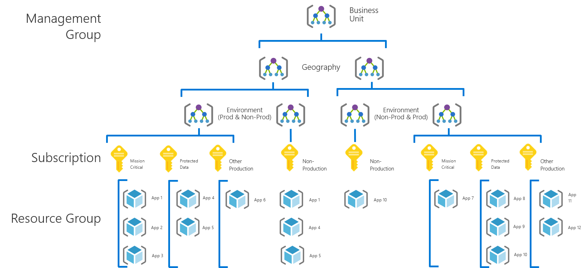
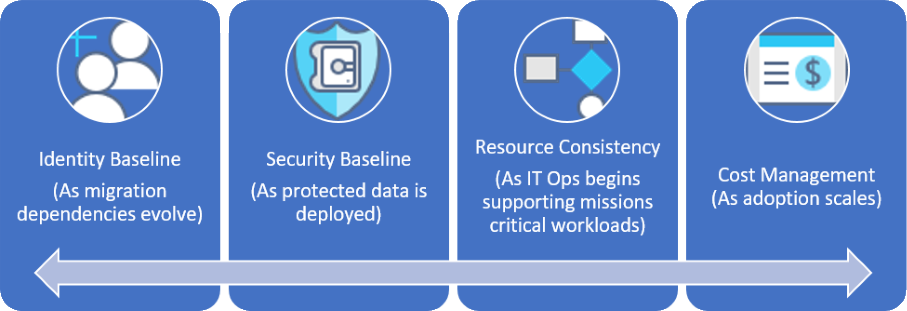

# Fusion: Large enterprise governance journey

## Best practice overview

This governance journey follows the experiences of a fictional company through various stages of governance maturity. It is based on real customer journeys. The suggested best practices are based on the constraints and needs of the fictional company.
As a quick starting point, this overview defines a minimum viable product (MVP) for governance based on best practices. It also provides links to a few governance evolutions that add further best practices as new business or technical risks emerge.

> [!WARNING]
> This MVP is a baseline starting point, based on a set of assumptions. Even this minimal set of best practices is based on corporate policies driven by unique business risks and risk tolerances. To see if these assumptions apply to you, read the [longer narrative](./use-case.md) that follows this article.

### Governance best practice

This best practice serves as a foundation that an organization can use to quickly and consistently add governance guardrails across multiple Azure subscriptions.

**Resource Organization**: The following represents the Governance MVP hierarchy for organizing resources. Every application should be deployed in the proper area of the Management Group, Subscription, and Resource Group hierarchy. During deployment planning, the Cloud Governance team will create the necessary nodes in the hierarchy to empower the Cloud Adoption team. 

1. A management group for each business unit with a detailed hierarchy that reflects geography then environment type (Production, Non-Prod).
2. A subscription for each unique combination of business unit, geography, environment, and “Application Categorization”. 
3. A separate resource group for each application.
4. Consistent nomenclature should be applied at each level of this grouping hierarchy. 

These patterns provide room for growth without complicating the hierarchy unnecessarily.

**Governance of Resources**: Enforcing governance across subscriptions will come from Azure Blueprints and the associated assets within the blueprint.

1. Create an Azure Blueprint named “Governance MVP”.
    1. Enforce the use of standard Azure roles.
    2. Enforce that users can only authenticate against existing an role-based access control (RBAC) implementation.
    3. Apply this blueprint to all subscriptions within the management group.
2. Create an Azure Policy to apply or enforce the following:
    1. Resource tagging should require values for Department/Billing Unit, Geography, Data Classification, Criticality, SLA, Environment, Application Archetype, Application, and Application Owner.
    2. The value of the Application tag should match the name of the resource group.
    3. Validate role assignments for each resource group and resource.
3. Publish the “Governance MVP” blueprint and apply it to each management group.

These patterns enable discovery and tracking of resources and enforce basic role management. 

**Demilitarized Zone Addition**: Specific subscriptions often require some level of access to on-premise resources. This is common in migration scenarios or dev scenarios where dependent resources reside in the on-premises datacenter.
1. Establish a cloud DMZ. 
    1. Refer to the [Cloud DMZ Reference Architecture](http://docs.microsoft.com/en-us/azure/architecture/reference-architectures/dmz/secure-vnet-hybrid) to see a pattern and deployment model for creating a VPN Gateway in Azure.
    2. Validate that proper DMZ connectivity and security requirements are in place for a local edge device in the on-premises datacenter.
    3. Validate that the local edge device is compatible with Azure VPN Gateway requirements.
    4. Once connectivity to the on-premise VPN has been verified, capture the Resource Manager template created by deployment of the reference architecture.
2. Create a second blueprint named “DMZ”. 
3. Add the Resource Manager template for the VPN Gateway to the blueprint.
4. Apply the “DMZ” blueprint to any subscriptions that require connectivity to the on-premises network. This blueprint should be applied in addition to the “Governance MVP” blueprint. 

One of the biggest concerns raised by IT security and traditional governance teams, is the risk that early stage cloud adoption will compromise existing assets. The above approach allows cloud adoption teams to build and migrate hybrid solutions, with reduced risk to on-premises assets. Later evolutions would remove this temporary solution.

> [!NOTE]
> The above is a starting point to quickly create a baseline governance MVP. This is only the beginning of the governance journey. Further evolution will be needed as the company continues to adopt the cloud and faces more risk in the following areas: 
>
> - Mission critical workloads
> - Protected data
> - Cost management
> - Multi-cloud scenarios
>
> The specific details of this MVP are based on the example journey of a fictitious company described in the articles that follow. We highly recommend becoming familiar with the other articles in this series before implementing this best practice.

### Governance evolutions

Once this MVP has been deployed, additional layers of governance can be quickly incorporated into the environment. Here are some ways to evolve the MVP to meet specific business needs.

- [Security baseline for protected data](./protected-data.md)
- [Resource configurations for mission critical applications](./mission-critical.md)
- [Controls for cost management](./cost-control.md)
- [Controls for multi-cloud evolution](./multi-cloud.md)

### What does this best practice do?

In the MVP, practices and tools from the Deployment Acceleration discipline are established to quickly apply corporate policy. The MVP makes use of Azure Blueprints, Azure Management Groups, and Azure Policy to apply a few basic corporate policies based on the fictional company narrative. Those corporate policies are applied using Resource Manager templates and Azure policies to establish a very small baseline for identity and security.

### Evolving the best practice

Over time, this governance MVP will be used to evolve the governance practices. As adoption advances, business risk grows. Various disciplines within the Fusion Governance Model will evolve to mitigate those risks. Later articles in this series discuss the evolution of corporate policy affecting the fictional company. These evolutions happen across three disciplines: 

- Identity Baseline, as migration dependencies evolve in the narrative
- Cost Management, as adoption scales.
- Security Baseline, as protected data is deployed.
- Resource Consistency, as IT Ops begins supporting mission-critical workloads.

## Next steps

Now that you’re familiar with the governance MVP and have an idea of the governance evolutions to follow, read the [supporting narrative](./use-case.md) for additional context.

> [!div class="nextstepaction"]
> [Review the supporting narrative](./use-case.md)
