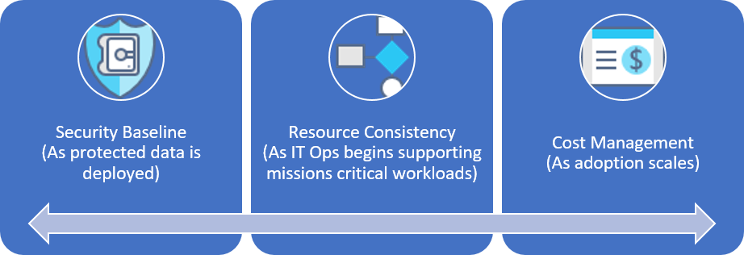
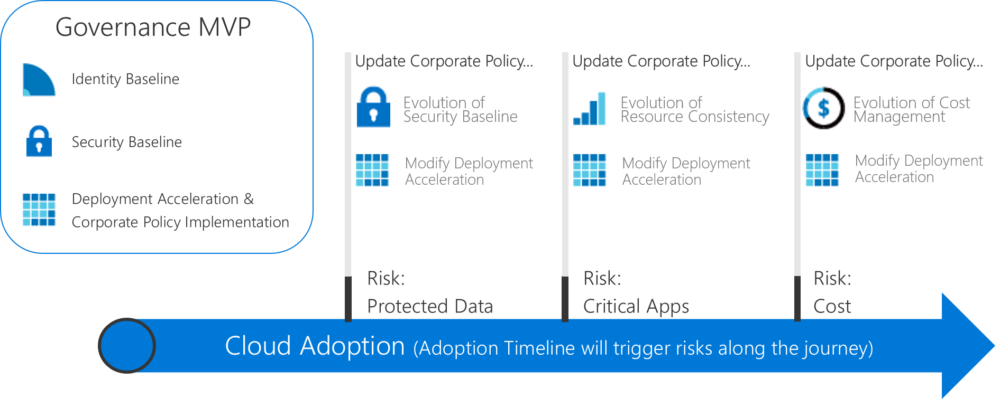

# Fusion: Small to Medium Enterprise Governance Design Guide

This design guide provides a narrative for small to medium enterprises as they move through the governance journey. The journey starts with the same general challenges faced by most small or medium enterprises when first beginning a cloud journey: establishing an initial strategy and implementing a foundation or MVP for governance. The guide will then demonstrate how that MVP implementation evolves ahead of the corporate cloud adoption strategy.

## Governance MVP (Cloud Adoption Foundation)

Any governance foundation requires a few simple principles as the root of enabling rapid governance evolutions. These are the first of the three Cloud Governance Disciplines to adopt in any governance process. Each is described further in this series of articles. To establish the starting point, this series of articles will discuss the high-level strategies behind Identity Management, Security Management, and Configuration Management that are required to create a Governance minimally viable product (MVP), which will serve as the foundation for all adoption.

### Governance Evolutions (Staying a step ahead of Cloud Adoption)

As adoption advance, business risk grows. The goal of an Incremental Cloud Governance approach is to stay ahead of adoption and mitigate those risks. Through this adoption guide, the Governance MVP will be evolved along three Cloud Governance Disciplines to add additional guardrails to the foundation. The additional disciplines in this design guide include evolutions to Cost, Security, and Resource Management.

While not explicated stated as an evolving discipline, Configuration Management is the primary tool for Cloud Governance. Through every evolution, Configuration Management will also evolve as guardrails are implemented. Likewise, Identity Management is a critical discipline to the enforcement of governance. Some evolutions may also evolve the Identity Management discipline.

> [!NOTE]
> These evolutions are not linear. Each evolution may be experienced at different points in the journey, based on incremental changes to the cloud adoption strategy and the associated risks.

### Corporate Policy

Throughout this journey, the narrative will evolve. The evolutions captured here are similar to those experienced during organic cloud adoption. As the narrative evolves, business risk will grow, as will corporate policy.

Corporate policy serves as the early warning system that makes incremental governance possible. It also defines the transition from business risk to actionable policy statements and recurring governance processes. In this design guide, each evolution will be marked by changes to the narrative. Those changes will be captured as changes to corporate policy. Corporate policy will then change implementation of the Governance MVP.

## Next steps

Before jumping into the Governance MVP, it is suggested that the reader familiarize themselves with the [core narrative](use-case.md) for this journey.

> [!div class="nextstepaction"]
> [Review the core narrative](use-case.md)