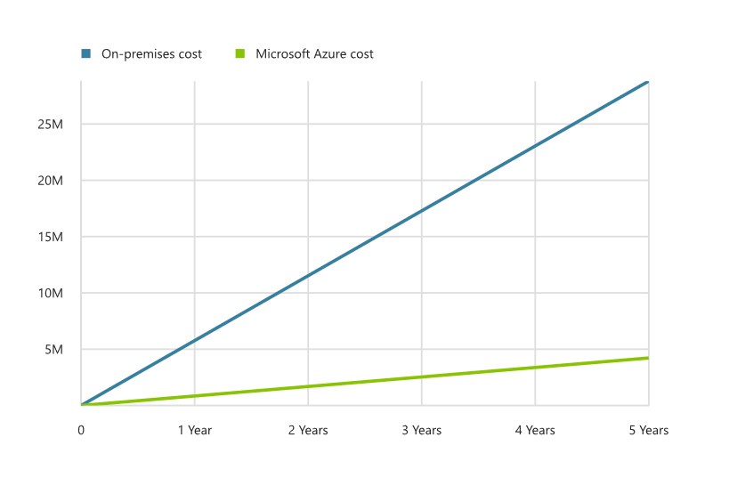

# Fusion: Small to Medium Enterprise - Initial Narrative behind the governance strategy

The following narrative establish a use case to drive the Small to Medium Enterprise Governance Design Guide. Before implementation of the design guide, it is import to understand how this narrative aligns with the actual narrative of the company which wishes to adopt this guide.

> [!NOTE]
> Note: This article is not technical at all. This narrative is still important, as it will drive a number of technical decisions. For those who need an immediate answer, jump ahead to the [Governance MVP](governance-mvp.mp) article. However, it is suggested that the Cloud Governance Team read this narrative prior to implementation of the design guidance.

## Back Story

The board of directors started the year with plans to energize the business in a number of new ways. They are pushing leadership to improve customer experiences to gain market share. They are also pushing for new products and services that will position the company as a thought-leader in the industry. At the same time, they pushed for a parallel effort to reduce waste and cut unnecessary costs. While the last effort is always intimidating, the actions of the board and leadership show that this is an effort to focus as much capital as possible on future growth.

Traditionally, the CIO in this company has been left out of these types of strategic conversations. However, the future vision is intrinsically linked to technical growth. As such, IT has had a seat at the table to help guide these big plans. On the downside, IT is now expected to deliver in a number of new ways. The team isn’t really prepared for these changes and is likely to struggle with a number of learning curves.

## Business Characteristics

* All sales and operations reside in a single country with a small percentage of global customers
* The business operates as a single business unit, with budget aligned to functions (Sales, Marketing, Operations, IT, etc...)
* The business views most of IT as a capital drain or a cost center.

## Current State

* IT operates two hosted infrastructure environments. On environment hosts production assets. The second hosts disaster recovery and some Dev/Test assets. These environments are hosted by two different providers. IT refers to these environments as their two datacenters, named Prod and DR respectively.
* IT entered the cloud by migrating all end user email to Office 365, which has been complete for over 6 months.
* Few IT assets have been deployed to the cloud.
* The application development teams are working in a dev/test capacity to learn about cloud native capabilities.
* The BI team is experimenting with big data in the cloud and curation of data on new data platforms.
* The company has a loosely defined policy stating that customer's PII (Personally Identifiable Information) and financial data cannot be hosted in the cloud, which limits mission critical applications in the current deployments.

## Future State

* The CIO is reviewing the policy on PII and financial data to allow for the future state goals.
* Both App Dev and BI would like to release production solutions to the cloud in the next 24 months which support the forward-looking visions for customer engagement and new products.
* This year, the IT team will complete a project to retire the disaster recovery aspects of the DR "Data Center", migrating 2,000 VMs to the cloud. When completed, this project is expected to produce an estimated $25M USD cost savings over the next five years.

## Next steps

Based on this narrative, a [Corporate Policy](./corporate-policy.md) has been drafted to shape the implementation.

> [!div class="nextstepaction"]
> [Review the corporate policy](./corporate-policy.md)
