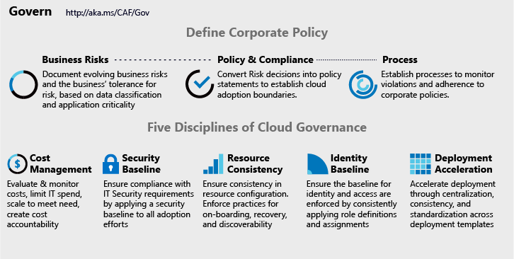

# Fusion: Develop Corporate Policy and Compliance

As described in the Incremental Model to Cloud Governance, the Fusion model to Cloud Governance is represented in the image below. This image serves as a framework for the end state of cloud governance. The current and evolving state would see varying degrees of maturity across the five disciplines, based on tangible business risks.

The top half of this diagram is referred to as Corporate Policy. All implementations of cloud governance stems from these three aspects. As adoption grows, so does business risk. That risk is mitigated through policy statements. Adherence to those policy statements is monitored through a process. Defining each of those three defines corporate policy.

## Developing corporate policy

### Understand & document risk

### Mitigate risk through policy statements

#### Metrics and Tolerance Indicators

Track progress and understand when to invest or evolve governance

### Establish and execute processes to fulfill the discipline

## Apply the theory

After choosing a design template, there will likely be modifications. Either immediately to implement the template or overtime as risks evolve.
In either case, the need to modify the template identifies a policy statement that needs to be changed or added. Starting with the corporate policy, will ensure clarity and support for the required governance changes.

## Next steps

Learn how to implement start building the Governance Partnership in the [Governance: Start Small Guide](./start-small.md)
> [!div class="nextstepaction"]
> [Governance: Start Small Guide](./start-small.md)