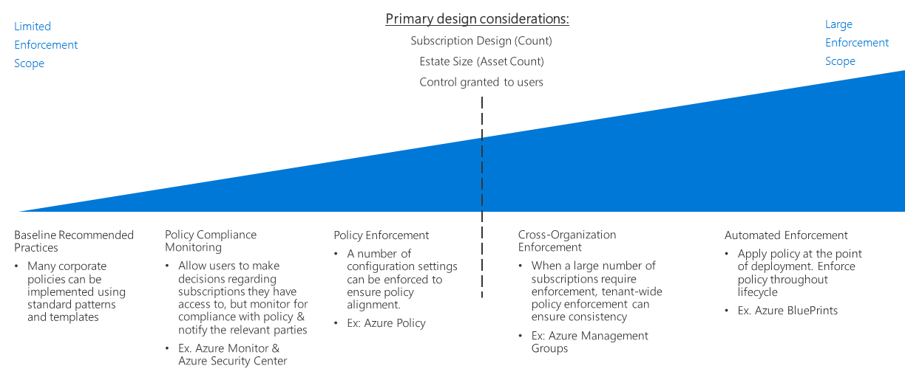

# Fusion: Policy enforcement

Defining organizational policy is not effective unless there is a way to enforce it across your organization. A key aspect to planning any cloud migration is determining how best to combine tools provided by the cloud platform with your existing IT processes to maximize policy compliance across your entire cloud estate.

## Policy enforcement decision guide

Jump to: [Cloud native](#cloud-native) | [Trust but verify](#trust-but-verify) | [Simple Enforcement](#simple-enforcement) | [Consistent enforcement across subscriptions](#consistent-enforcement-across-subscriptions) | [Third party log monitoring](#third-party-log-monitoring)

As your cloud estate grows, you will be faced with a corresponding need to maintain and enforce policy across a larger array of resources, subscriptions, and tenants. The larger your estate, the more complex your enforcement mechanisms will need to be to ensure consistent adherence and fast violation detection. Platform provided policy enforcement mechanisms at the resource or subscription level are usually sufficient for smaller cloud deployments, while lager deployments may need to take advantage of more sophisticated mechanisms involving deployment standards, resource grouping and organization, and integrating policy enforcement with you logging and reporting systems.

The key inflection point when choosing the complexity of your policy enforcement strategy is primarily focused on the number of subscriptions or tenants required by your [subscription design](../subscriptions/overview.md). The amount of control granted to various user rolls within your cloud estate might influence these decisions as well.

### Cloud native

For single subscription and simple cloud deployments, many corporate policies can be enforced using features that are native to most cloud platforms. Even at this relatively low level of deployment complexity, the proper use of components discussed throughout this guide's [infrastructure section](../overview.md).

For instance, [deployment templates](../resource-grouping/overview.md#deployment-grouping-templated-deployments) can provision resources with standardized structure and configuration. [Tagging and naming](../resource-tagging/overview.md) standards can help organize operations and support accounting and business requirements. Traffic management and networking restrictions can be implemented through [software defined networking](../software-defined-networks/overview.md). [Role-base access control](../identity/overview.md) can secure and isolate your cloud resources.

Start your cloud policy enforcement planning by examining how these standard features and services can help meet your organizational requirements.

### Trust but verify

Another key factor, even for relatively small cloud deployments, is the ability to verify that cloud-based applications and services are in compliance with organizational policy, and to promptly notify responsible parties if a resource falls out of compliance. Properly designing your [logging and reporting](../logs-and-reporting/overview.md) approach to monitor your cloud workloads for compliance is a critical part of any corporate policy enforcement strategy.

As your cloud estate grows, additional tools such as [Azure Security Center](/azure/security-center/) can provide integrated security and threat detection, and help apply centralized policy management and alerting for both your on-premises and cloud assets.

### Simple enforcement

You can also apply configuration settings and resource creation rules at the subscription level to help ensure policy alignment.

[Azure Policy](/azure/governance/policy/overview) is a service that allows you to apply governance rules directly to subscriptions and resource groups. These rules help you control what types of resources you can deploy within a subscription or resource group, and how those resources can be used. For instance, you can create a rule to allow resources to only be deployed to a certain geo-region, or to require that all VMs must be connected to a specific subnet of a virtual network.

### Consistent enforcement across subscriptions

As your cloud estate grows to span many subscriptions that require enforcement, you will need to focus on a tenant-wide enforcement strategy to ensure policy consistency.

Your [subscription design](../subscriptions/overview.md) will need to account for policy as it relates to your organizational structure. In addition to helping support complex organization within your subscription design, [Management groups](../subscriptions/overview.md#management-groups) are capable of applying Azure Policy rules across multiple subscriptions.

Similarly to using standardized deployment templates at the smaller scale, [Azure Blueprints](/azure/governance/blueprints/overview) allow large-scale standardized provisioning of Azure solutions. This enables the deployment of workloads across multiple subscriptions with consistent policy settings for any resources created.

### Third party log monitoring

For particularly complex IT environments integrating cloud and on-premises resources, you may need to make use of [logging and reporting](../logs-and-reporting/overview.md) systems with hybrid monitoring capabilities.

You third party or other custom operational monitoring systems may offer additional policy enforcement capabilities. For complicated cloud estates, consider how best to integrate these systems with your cloud assets.

## Next steps

Learn how [resource grouping](../resource-grouping/overview.md) is used to organize and standardize cloud deployments in support of subscription design and governance goals.

> [!div class="nextstepaction"]
> [Resource Grouping](../resource-grouping/overview.md)
